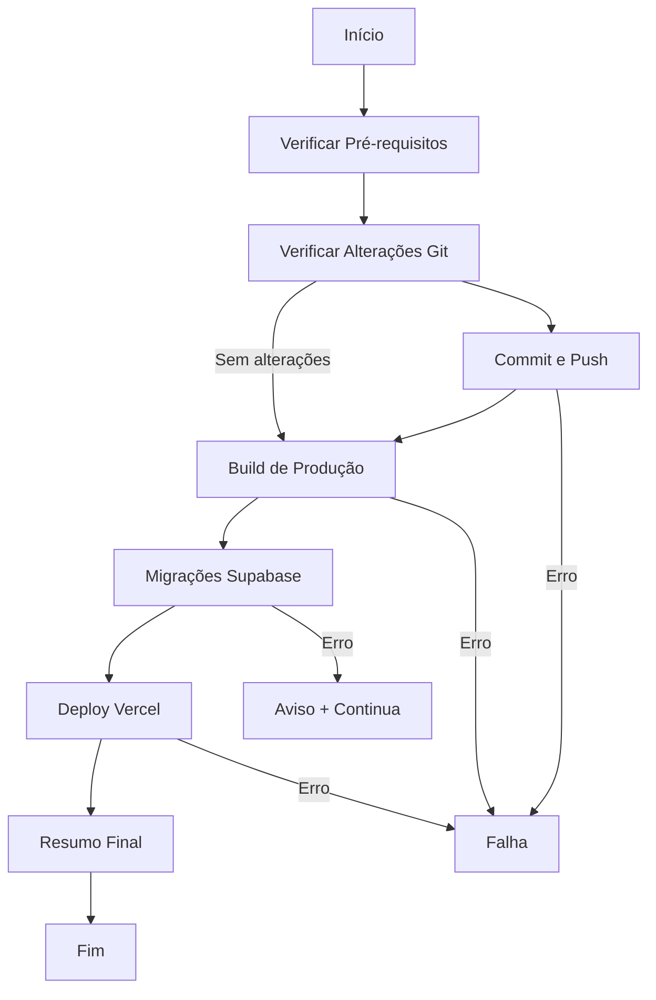

# 🚀 Instruções de Deploy Automático - TV Doutor ADS

Este documento explica como usar o sistema de deploy automático configurado para o projeto.

## 📋 Pré-requisitos

Antes de usar o deploy automático, certifique-se de ter instalado:

1. **Node.js** (versão 18 ou superior)
2. **Vercel CLI**: `npm i -g vercel`
3. **Supabase CLI**: `npm i -g supabase`
4. **Git** configurado com suas credenciais

## 🔧 Configuração Inicial

### 1. Configurar Vercel CLI
```bash
vercel login
vercel link
```

### 2. Configurar Supabase CLI
```bash
npx supabase login
npx supabase link --project-ref vaogzhwzucijiyvyglls
```

## 🚀 Comandos de Deploy

### Deploy Automático Completo (Recomendado)
```bash
npm run deploy:auto
```

Este comando executa:
- ✅ Verifica alterações no Git
- ✅ Faz commit e push das alterações
- ✅ Executa build de produção
- ✅ Aplica migrações do Supabase
- ✅ Faz deploy para Vercel (produção)

### Deploy em Modo Preview
```bash
npm run deploy:auto:preview
```

### Deploy com Opções Personalizadas
```bash
# Deploy com mensagem personalizada
node scripts/deploy.js --message="Correção de bugs críticos"

# Deploy pulando commit
node scripts/deploy.js --skip-commit

# Deploy pulando Supabase
node scripts/deploy.js --skip-supabase

# Deploy em preview
node scripts/deploy.js --preview
```

## 📝 Scripts Disponíveis

| Comando | Descrição |
|---------|-----------|
| `npm run build` | Build padrão |
| `npm run build:prod` | Build de produção |
| `npm run build:deploy` | Build + Deploy Vercel |
| `npm run deploy:vercel` | Deploy para Vercel (produção) |
| `npm run deploy:preview` | Deploy para Vercel (preview) |
| `npm run deploy:supabase` | Aplicar migrações Supabase |
| `npm run deploy:auto` | **Deploy automático completo** |
| `npm run deploy:auto:preview` | Deploy automático (preview) |

## 🔄 Fluxo de Deploy Automático



## 🌐 URLs de Produção

- **Aplicação**: https://tvdoutor-ads.vercel.app
- **Preview**: https://tvdoutor-ads-git-main.vercel.app
- **Supabase Dashboard**: https://supabase.com/dashboard
- **Vercel Dashboard**: https://vercel.com/dashboard

## 🛠️ Scripts Personalizados

### PowerShell (Windows)
```powershell
# Deploy completo
.\scripts\deploy-automatic.ps1

# Deploy com mensagem personalizada
.\scripts\deploy-automatic.ps1 -Message "Nova funcionalidade"

# Deploy em preview
.\scripts\deploy-automatic.ps1 -Preview
```

### Bash (Linux/macOS)
```bash
# Deploy completo
./scripts/deploy-automatic.sh

# Deploy com opções
./scripts/deploy-automatic.sh --message "Correção de bugs" --preview
```

## 🔍 Troubleshooting

### Erro: "Vercel CLI não encontrado"
```bash
npm i -g vercel
vercel login
```

### Erro: "Supabase CLI não encontrado"
```bash
npm i -g supabase
npx supabase login
```

### Erro: "Permission denied"
```bash
# No Linux/macOS
chmod +x scripts/deploy-automatic.sh

# No Windows
Set-ExecutionPolicy -ExecutionPolicy RemoteSigned -Scope CurrentUser
```

### Erro de Build
1. Verifique se todas as dependências estão instaladas: `npm install`
2. Execute o build localmente: `npm run build:prod`
3. Verifique os logs de erro

### Erro de Deploy Vercel
1. Verifique se está logado: `vercel whoami`
2. Verifique se o projeto está linkado: `vercel link`
3. Verifique as variáveis de ambiente no dashboard do Vercel

## 📊 Monitoramento

Após o deploy, monitore:
- **Vercel**: Logs de build e runtime
- **Supabase**: Logs de banco de dados
- **Aplicação**: Console do navegador para erros

## 🔐 Variáveis de Ambiente

Certifique-se de que as seguintes variáveis estão configuradas no Vercel:

- `VITE_SUPABASE_URL`
- `VITE_SUPABASE_ANON_KEY`

## 📞 Suporte

Em caso de problemas:
1. Verifique os logs de erro
2. Consulte a documentação do Vercel e Supabase
3. Verifique se todas as dependências estão atualizadas

---

**Última atualização**: 31 de Janeiro de 2025
