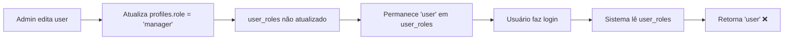

# Resumo: Problema de Roles Manager

## 🔴 Problema Reportado

Usuários com função 'manager' apareciam apenas como 'user' no sistema:
- `publicidade5@tvdoutor.com.br`
- `publicidade6@tvdoutor.com.br`
- `suporte@tvdoutor.com.br`

## 🔍 Causa Raiz Identificada

### Inconsistência entre Tabelas

O sistema possui duas tabelas que armazenam roles:

| Tabela | Propósito | Atualizado por |
|--------|-----------|----------------|
| `profiles` | Legacy, compatibilidade | Interface Users.tsx ✅ |
| `user_roles` | Tabela principal de roles | Interface Users.tsx ❌ |

### Código Problemático

**`src/pages/Users.tsx` (linha 321-325):**
```typescript
// ❌ Atualiza apenas profiles
const { data, error } = await supabase
  .from('profiles')
  .update(updatePayload)
  .eq('id', editingUser.id)
  .select();

// ❌ user_roles NÃO é atualizado!
```

**`src/contexts/AuthContext.tsx` (linha 98-104):**
```typescript
// ✅ Lê role de user_roles (não de profiles!)
const rolePromise = supabase
  .from('user_roles')
  .select('role')
  .eq('user_id', userId as any)
  .order('role', { ascending: true })
  .limit(1)
  .maybeSingle();
```

### Fluxo do Problema



## ✅ Soluções Aplicadas

### 1. Correção Imediata (SQL)

**Arquivo:** `APLICAR_AGORA_CORRECAO_ROLES.sql`

```sql
-- Atualizar profiles
UPDATE public.profiles
SET role = 'manager'
WHERE email IN (...);

-- Adicionar em user_roles
INSERT INTO public.user_roles (user_id, role)
SELECT p.id, 'manager'::app_role
FROM public.profiles p
WHERE p.email IN (...)
ON CONFLICT (user_id, role) DO NOTHING;

-- Remover role 'user' antiga
DELETE FROM public.user_roles
WHERE user_id IN (...)
AND role = 'user';
```

**Como aplicar:**
1. Acesse Supabase Dashboard
2. SQL Editor > New Query
3. Cole o conteúdo de `APLICAR_AGORA_CORRECAO_ROLES.sql`
4. Execute (Run)
5. ✅ Verifique resultado na query final

**⏱️ Tempo:** 30 segundos

### 2. Correção no Código (TypeScript)

**Arquivo:** `src/pages/Users.tsx`

**Alteração:** Adicionado código para atualizar `user_roles` quando role é alterado:

```typescript
// 5. Se a role foi alterada, atualizar também a tabela user_roles
if (currentRole !== newRole && isCurrentUserAdmin) {
  logDebug('Atualizando user_roles', { userId: editingUser.id, newRole });
  
  // Remover role antiga da tabela user_roles
  if (currentRole && currentRole !== 'super_admin') {
    await supabase
      .from('user_roles')
      .delete()
      .eq('user_id', editingUser.id)
      .eq('role', currentRole);
  }
  
  // Adicionar nova role na tabela user_roles
  const { error: roleError } = await supabase
    .from('user_roles')
    .upsert({
      user_id: editingUser.id,
      role: newRole,
      created_at: new Date().toISOString(),
    }, {
      onConflict: 'user_id,role'
    });
  
  if (roleError) {
    logError('Error updating user_roles', roleError);
    console.warn('Aviso: Não foi possível atualizar user_roles:', roleError.message);
  } else {
    logDebug('user_roles atualizado com sucesso');
  }
}
```

**Benefícios:**
- ✅ Mantém `profiles` e `user_roles` sincronizados
- ✅ Remove role antiga para evitar conflitos
- ✅ Adiciona nova role corretamente
- ✅ Logs de debug para troubleshooting
- ✅ Não bloqueia se houver erro em user_roles (fallback)

## 📋 Checklist de Aplicação

### Passo 1: Correção Imediata (Urgente)
- [ ] Acessar Supabase Dashboard
- [ ] Executar `APLICAR_AGORA_CORRECAO_ROLES.sql`
- [ ] Verificar resultado da query
- [ ] Confirmar que os 3 usuários têm role 'manager' em ambas as tabelas

### Passo 2: Teste com Usuários
- [ ] Pedir aos usuários para fazer logout
- [ ] Pedir para fazer login novamente
- [ ] Confirmar que aparece badge "Manager" no perfil
- [ ] Confirmar acesso às páginas:
  - [ ] `/reports` - Relatórios
  - [ ] `/venues` - Locais
  - [ ] `/users` - Usuários
  - [ ] `/pessoas-projeto` - Pessoas
  - [ ] `/gerenciamento-projetos` - Projetos

### Passo 3: Deploy do Código Corrigido
- [ ] Revisar alterações em `src/pages/Users.tsx`
- [ ] Testar edição de usuário em ambiente local
- [ ] Fazer commit das alterações
- [ ] Deploy para produção
- [ ] Testar em produção alterando role de um usuário teste

## 🧪 Teste de Validação

### Teste Manual

1. **Login como super_admin**
2. **Ir para /users**
3. **Editar um usuário teste:**
   - Alterar role de 'user' para 'manager'
   - Salvar
4. **Verificar no banco:**
   ```sql
   SELECT 
       p.email,
       p.role as profile_role,
       array_agg(ur.role::TEXT) as user_roles
   FROM public.profiles p
   LEFT JOIN public.user_roles ur ON p.id = ur.user_id
   WHERE p.email = 'usuario_teste@exemplo.com'
   GROUP BY p.email, p.role;
   ```
   **Resultado esperado:**
   ```
   email                    | profile_role | user_roles
   -------------------------|--------------|------------
   usuario_teste@...        | manager      | {manager}
   ```

5. **Fazer logout e login como o usuário teste**
6. **Verificar badge e permissões**

## 📝 Arquivos Relacionados

### Scripts SQL
- ✅ `APLICAR_AGORA_CORRECAO_ROLES.sql` - **Executar primeiro (urgente)**
- 📖 `check_manager_users_roles.sql` - Diagnóstico
- 🛠️ `fix_manager_users_roles.sql` - Correção completa com logs

### Documentação
- 📚 `CORRECAO_ROLES_MANAGER.md` - Documentação completa
- ⚡ `APLICAR_CORRECAO_ROLES_MANAGER.md` - Guia rápido
- 📊 `RESUMO_PROBLEMA_ROLES_MANAGER.md` - Este arquivo

### Código
- 🔧 `src/pages/Users.tsx` - Correção aplicada (linhas 333-364)
- 📖 `src/contexts/AuthContext.tsx` - Lógica de carregamento de roles

## 🚨 Importante

### Os usuários precisam:
1. ✅ **Fazer LOGOUT**
2. ✅ **Fazer LOGIN novamente**
3. ✅ **Limpar cache do navegador** (Ctrl+Shift+Delete) se necessário

### Ordem de Execução:
1. 🔴 **Primeiro:** Executar SQL (`APLICAR_AGORA_CORRECAO_ROLES.sql`)
2. 🟡 **Depois:** Pedir aos usuários para fazer logout/login
3. 🟢 **Por fim:** Deploy do código corrigido

## 🔐 Hierarquia de Roles

```
super_admin  (Acesso total, gerencia tudo)
    ↓
  admin      (Gerencia, edita, exclui)
    ↓
 manager     (Visualiza, cria, edita - NÃO exclui)
    ↓
 client      (Visualiza projetos atribuídos)
    ↓
  user       (Acesso padrão)
```

## 📊 Status Atual

| Item | Status | Observações |
|------|--------|-------------|
| Problema Identificado | ✅ | Inconsistência entre profiles e user_roles |
| Causa Raiz Documentada | ✅ | Users.tsx não atualiza user_roles |
| Script SQL Criado | ✅ | APLICAR_AGORA_CORRECAO_ROLES.sql |
| Código Corrigido | ✅ | Users.tsx atualizado |
| Teste Necessário | ⏳ | Aguardando execução do SQL |
| Deploy Necessário | ⏳ | Após testes |

## 🎯 Próximos Passos

1. **URGENTE:** Executar `APLICAR_AGORA_CORRECAO_ROLES.sql` no banco de produção
2. Notificar os 3 usuários para fazer logout/login
3. Verificar se está funcionando corretamente
4. Fazer commit do código corrigido
5. Deploy para produção
6. Validar em produção com usuário teste

---

**Data:** 2025-10-13  
**Responsável:** Sistema de Desenvolvimento  
**Prioridade:** 🔴 Alta  
**Tempo Estimado:** 15 minutos (correção + teste)

